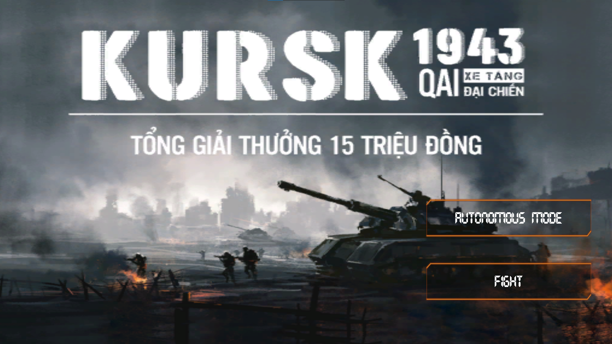

# Kursk 1943 FPT Software - Quy Nhơn AI
[Vietnamese version - English update soon ...]
## Summary
* [Introduction](#Introduction)
* [Game Play](#Game-Play)
* [Game Mode](#Game-Mode)
* [Cấu trúc thư mục](#Cấu-trúc-thư-mục)
* [Hướng dẫn chạy mã nguồn mở](#Hướng-dẫn-chạy-mã-nguồn-mở)

## Introduction
* Opensource học tăng cường của cuộc thi Kursk 1943 do Quy Nhơn AI tổ chức được Ban tổ chức cung cấp cho các đội chơi để hiểu thêm về kiến trúc, flow xử lý, phương thức giao tiếp giữa người chơi và môi trường game.
* Opensource sử dụng thuật toán học tăng cường Deep Q Learning tuy nhiên BTC không yêu cầu các đội buộc phải sử dụng thuật toán học tăng cường mà các đội hoàn toàn có thể sử dụng các thuật toán khác để tham gia cuộc thi này.

## Game Play
* Luật chơi rất đơn giản, tiêu diệt xe tăng địch và dành chiến thắng. 
* Trong bản đồ có nhiều công trình kiên cố như nhà, boong-ke, tảng đá, vì thế hãy di chuyển một cách thật khôn khéo, lợi dụng địa hình để tránh đạn, khai hỏa chính xác và dành chiến thắng.
* Game gồm nhiều quy tắc: Quy tắc công trình, Quy tắc di chuyển, Quy tắc điều khiển bắn, Quy tắc chiến thắng, ...
* Chi tiết các bạn có thể đọc và tìm hiểu thêm trong 2 tài liệu mà BTC có đính kèm khi đăng ký tham gia cuộc thi để biết thêm chi tiết.

## Game Mode

Game có 3 mode:
* Autonomous Mode: Chế độ sử dụng cho việc training và testing model AI của bạn
* Fight Mode: Chế độ PvP giữa các người chơi (được sử dụng khi thi đấu)

Game có 3 map thi đấu:

## Cấu trúc thư mục

Cấu trúc thư mục:
1. Thư mục Train: Chứa mã nguồn liên quan đến việc huấn luyện model AI
2. Thư mục Predict: Chứa mã nguồn liên quan đến việc chạy thử model AI
3. `game_server.cfg` : Config file chưa thông tin game
4. `test_server.py` : Sử dụng để test server kết nối thành công hay không
5. `requirements.txt` : Chứa requirements cần thiết để chạy mã nguồn mở

## Hướng dẫn chạy mã nguồn mở

BTC khuyến nghị các đội chơi sử dụng `python 3.7` 
Đầu tiên chúng ta cần tạo môi trường python bằng cách sử dụng conda

`$ conda create --name <env> python=3.7`

Tiếp theo chúng ta sẽ khởi chạy môi trường vừa tạo

`$ conda activate <env> `

Cuối cùng chúng ta sẽ cài đặt các thư viện yêu cầu cho môi trường vừa tạo

`$ pip install -r requirements.txt`

Để chạy game trước tiên chúng ta cần chạy server socket trước:

`$ python run_server.py`

Tiếp theo đó chúng ta sẽ chạy code điều khiển. Sẽ có 2 loại code điều khiền là để train model và để predict model

1. Hướng dẫn sử dụng train model
* `$ cd Train`
* `$ python train.py`

2. Hướng dẫn sử dụng predict model
* `$ cd Predict`
* `$ python predict.py`

Tiếp theo đó chúng ra sẽ chạy game lauch và chọn mode `Autonomous Mode`

Sau đó nhập địa chỉ socket vào màn hình để tiến hành kết nối vào game. Ví dụ `127.0.0.1:4567`

--------------------------

Chi tiết về phần code và flow xử lý đã được mô tả chi tiết trong tài liệu BTC cung cấp cho các đội chơi.
 
Chúc các bạn có một trải nghiệm game thú vị.
 
Thân ái và Quyết thắng!
 
BTC Kursk 1943

